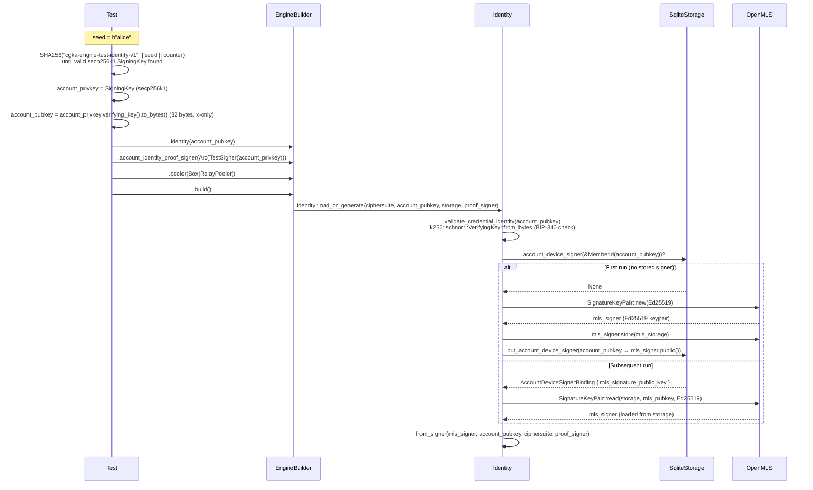
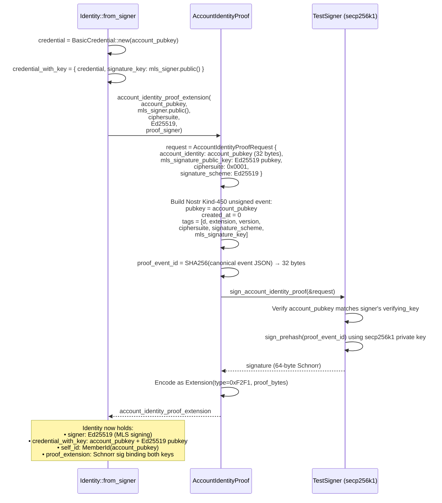
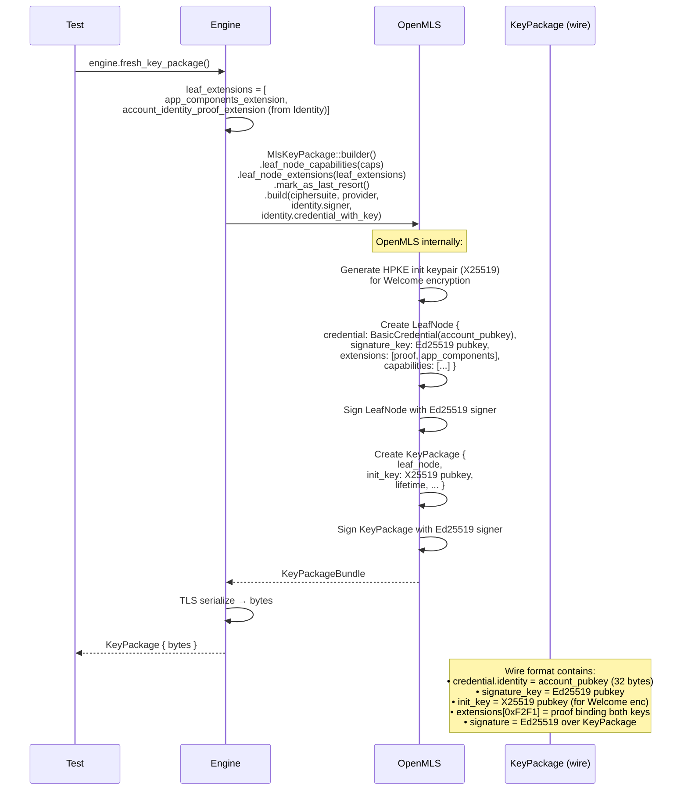
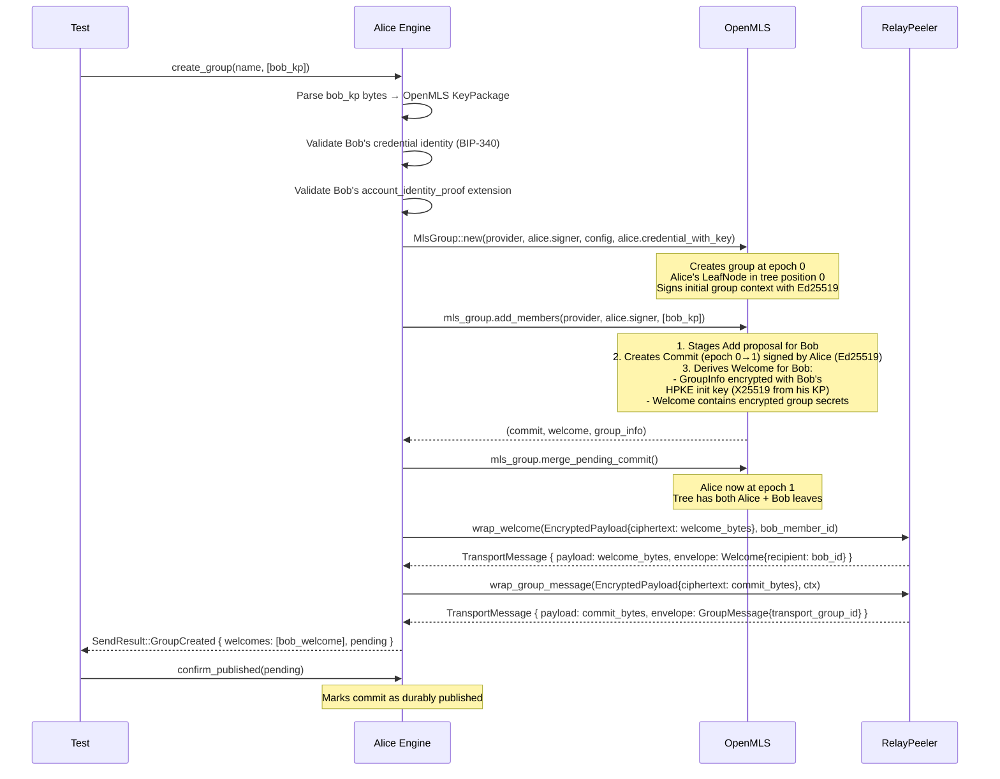
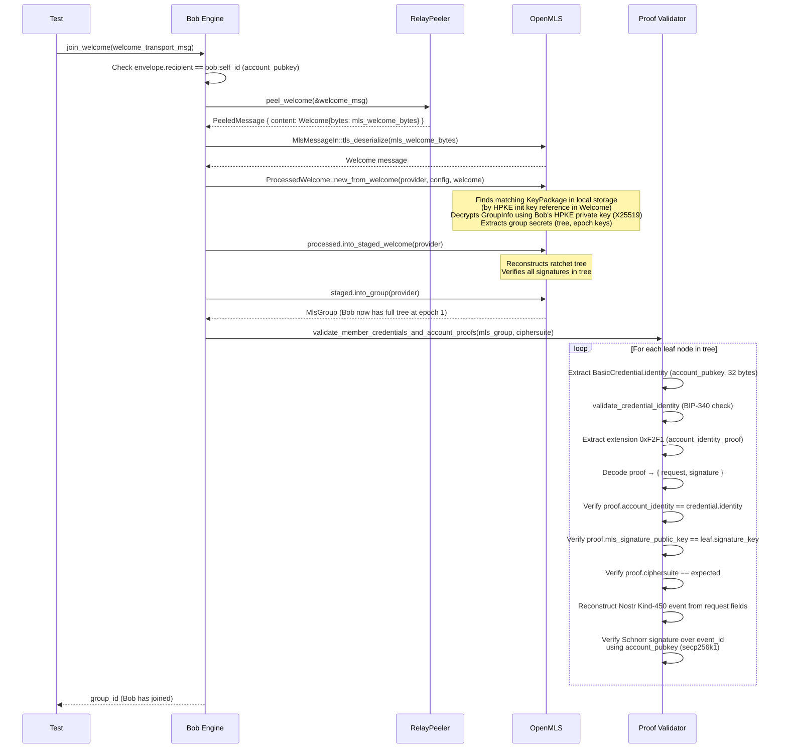
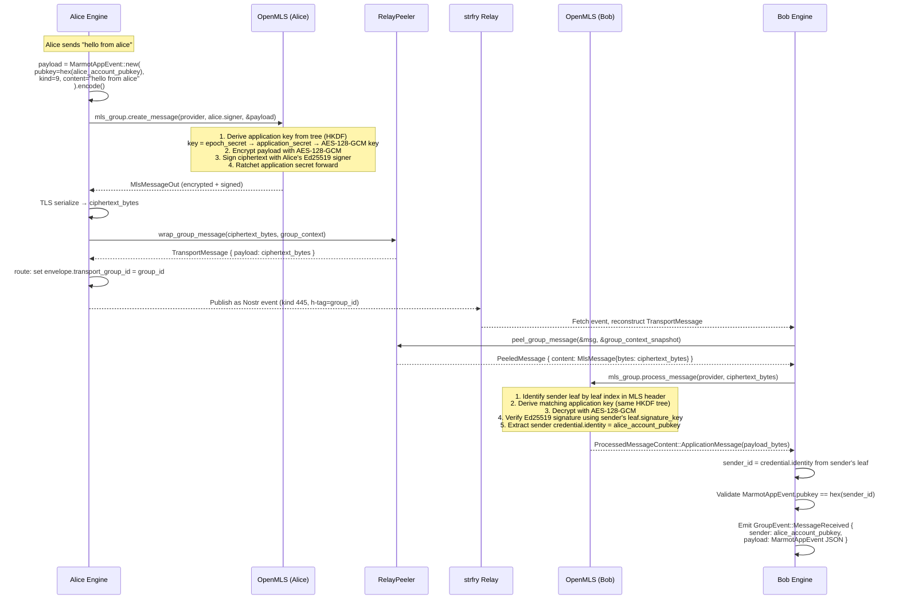
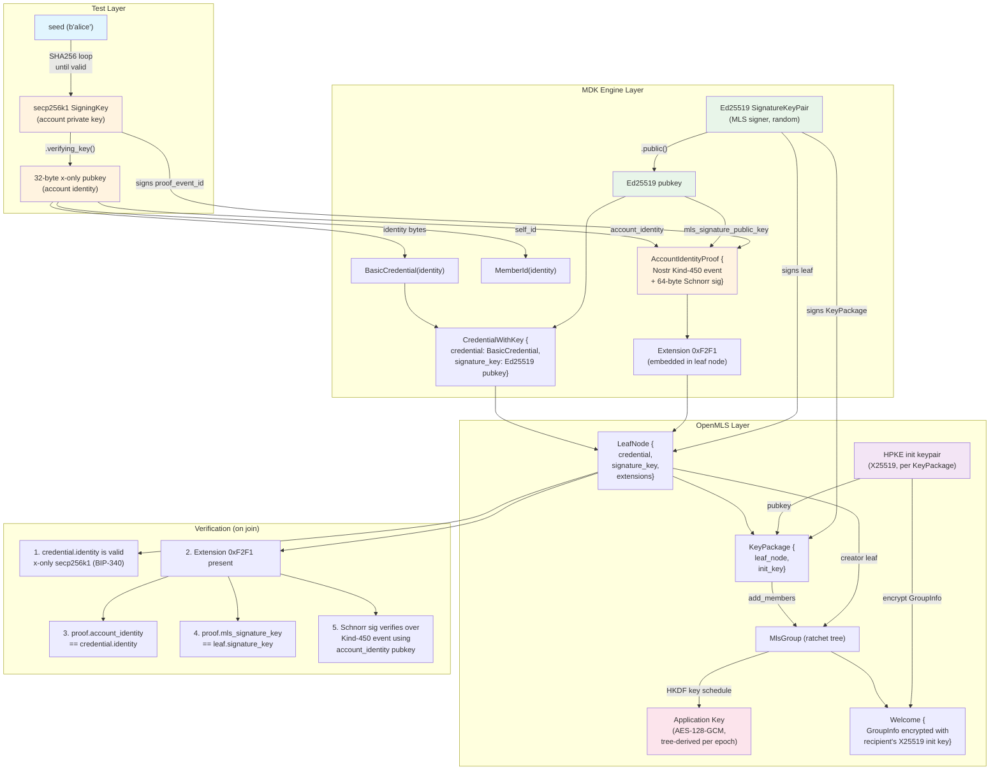

# MDK Key Flow: Test Case → Engine → OpenMLS

How the different key materials flow from test setup through the MDK engine into OpenMLS.

## Key Material Overview

| Key | Type | Origin | Purpose |
|-----|------|--------|---------|
| Account key (private) | secp256k1 Schnorr | Test seed → SHA256 loop | Signs account identity proof |
| Account identity | 32-byte x-only secp256k1 pubkey | Derived from account key | Credential identity in every leaf node |
| MLS signer (private) | Ed25519 | OpenMLS `SignatureKeyPair::new()` | Signs MLS messages, commits, key packages |
| MLS signature pubkey | Ed25519 | Derived from MLS signer | Embedded in leaf node `signature_key` |
| HPKE init key | X25519 | OpenMLS KeyPackage builder | Encrypts Welcome messages to recipient |
| Group application key | AES-128-GCM | Tree-derived per epoch (HKDF) | Encrypts/decrypts application messages |

## 1. Engine Build — Identity Setup

## 2. Account Identity Proof — Binding Account Key to MLS Key

## 3. KeyPackage Creation

## 4. Group Creation + Welcome

## 5. Welcome Join (Bob)

## 6. Application Message Send + Receive

## 7. Complete Key Relationship Diagram

## Ciphersuite

All operations use `MLS_128_DHKEMX25519_AES128GCM_SHA256_Ed25519`:

| Component | Algorithm |
|-----------|-----------|
| Key Exchange (HPKE) | X25519 |
| Encryption | AES-128-GCM |
| Hash | SHA-256 |
| Signature | Ed25519 |

The account identity key (secp256k1 Schnorr) is **not** part of the MLS ciphersuite. It exists at the Marmot protocol layer to bind a Nostr identity to the MLS signing key via the account identity proof extension.
