# Nostr Message Flow: Alice Opens a Chat With Bob

Which Nostr events cross the wire when one user starts an encrypted
conversation with another — and which steps never leave the device.

Companion to [mdk-key-flow.md](mdk-key-flow.md), which traces the key
material through the engine and stops at the crypto boundary. This
document covers the transport.

Event kinds verified against `mdk` @ `324d9a07`. Normative statements
cite the Marmot spec at
[marmot-protocol/marmot](https://github.com/marmot-protocol/marmot).

## The events involved

Six kinds carry the whole exchange.

| Kind | Name | Purpose |
|------|------|---------|
| `10002` | NIP-65 relay list | Where Bob reads and writes. Also where KeyPackages are published and fetched. |
| `10050` | Marmot inbox relay list | Where to deliver Bob's Welcome. Separate from his general relays. |
| `30443` | KeyPackage | Bob's Ed25519 signing key, X25519 init key, Nostr credential, identity proof. Addressable; consumed on use. |
| `1059` | NIP-59 gift wrap | Hides who is talking to whom. Signed by a throwaway key. |
| `444` | Welcome rumor | The MLS Welcome. Unsigned, and only ever seen inside the wrap. |
| `445` | Group message | Every message after the join. Opaque ciphertext, ephemeral sender. |

There is no dedicated KeyPackage relay list. KeyPackage discovery uses
the account's kind `10002` NIP-65 set; kind `10050` is for Welcome
delivery only.

## The exchange

```mermaid
sequenceDiagram
    autonumber
    actor A as Alice
    participant AR as Alice's relays
    participant BR as Bob's relays
    actor B as Bob

    rect rgb(22, 36, 29)
    note over B,BR: Ahead of time — Bob is discoverable
    B->>BR: kind 10002 · relay list
    B->>BR: kind 10050 · inbox relays
    B->>BR: kind 30443 · KeyPackage
    end

    note over A: Alice decides to message Bob

    A->>BR: fetch 10002 + 10050 for Bob
    BR-->>A: relay lists
    A->>BR: fetch 30443 for Bob
    BR-->>A: Bob's KeyPackage

    rect rgb(31, 42, 32)
    note over A: Local only — nothing sent
    A->>A: verify identity proof binds<br/>Bob's Nostr key to his MLS key
    A->>A: create MLS group, Add Bob, Commit
    A->>A: group now at epoch 1
    end

    A->>BR: kind 1059 gift wrap → Bob's inbox<br/>(seals kind 444 Welcome)
    BR-->>B: kind 1059
    B->>B: unwrap → 444 → HPKE-decrypt Welcome<br/>with X25519 init key
    B->>B: joined at epoch 1

    rect rgb(22, 36, 29)
    note over A,B: Channel open — both directions, same shape
    A->>AR: kind 445 · h=group_id
    AR-->>B: kind 445
    B->>BR: kind 445 · h=group_id
    BR-->>A: kind 445
    end
```



Steps 10–12 produce no network traffic. The group exists before Bob
hears about it.

## What a kind 445 is made of

Four layers. Only the outermost is visible to a relay.

| Layer | Content |
|-------|---------|
| Outer | Nostr event, kind `445`, signed by a **fresh ephemeral key** generated for that one event — never Alice's account key, never reused. |
| Routing | An `h` tag holding the hex of the 32-byte `nostr_group_id`. This is all a relay can sort on. |
| Content | `base64(nonce \|\| ciphertext)` — one ChaCha20-Poly1305 sealing under empty AAD, keyed by the **MLS exporter secret** for the current epoch. |
| Payload | The MLS message itself, with its own per-epoch ratcheted key and its own sender authentication. |

## What never touches Nostr

- **Group creation.** Alice builds the group, adds Bob, and commits
  entirely on her own device. The group reaches epoch 1 before a
  single packet is sent.
- **The message key.** Group application keys are ratcheted from the
  MLS tree each epoch, not transported. Nothing on the wire carries
  one.
- **Alice's identity, per message.** Every kind `445` is signed by a
  throwaway key, so the relay sees traffic on a group id, not a
  conversation between two known people.

## KeyPackage lifecycle

A KeyPackage's X25519 init key is single-use. OpenMLS enforces this by
deleting the private key on successful Welcome processing
(`openmls/src/group/mls_group/creation.rs`, `keys_for_welcome`):

```rust
if !key_package_bundle.key_package().last_resort() {
    provider.storage().delete_key_package(&hash_ref)?;
} else {
    log::debug!("Key package has last resort extension, not deleting");
}
```

The spec (`foundation/key-packages.md`) states three rules:

| Condition | Rule |
|-----------|------|
| Welcome processed successfully | Client **SHOULD** publish a fresh replacement |
| Welcome processed successfully | Private `init_key` for a non-last-resort KeyPackage **MUST** be deleted |
| Welcome processing **failed** | Client **MUST NOT** rotate or delete the consumed KeyPackage |

The failure rule matters: rotation is conditional on success, so a
failed join leaves the KeyPackage intact and the inviter can retry.

Kind `30443` is addressable, so an event is identified by
`(kind, pubkey, d-tag)`. The `d` tag is a random non-empty slot id —
currently a random 32-byte hex value. Bob keeps several slots, each
independently replaceable; "publish a new KeyPackage" means writing a
fresh one into a slot, not appending to a queue.

### Known gap

mdk exposes rotation only as an explicit `AccountWorkerCommand`
(`RotateKeyPackage`). Nothing in the Welcome-processing path calls it,
so the spec's SHOULD-rotate-on-success is left to the host
application. Any client built on mdk has to own KeyPackage
replenishment itself.

## Two details that bite

**Last-resort KeyPackages.** A marked KeyPackage survives use, so Bob
stays reachable when his slots run dry. It trades the forward secrecy
the one-time rule buys, and is a floor rather than a plan. The adopted
spec encodes it as the draft-10 `last_resort_key_package` component in
the `app_data_dictionary`, not the obsolete `last_resort` extension —
which is what erskingardner's openmls commit `85990fd44`
implements.

**Inbox relays are not relay lists.** Kind `10050` is a separate list
from `10002`. Welcomes go to the inbox relays; sending one to the
wrong set means Bob never joins, with no error anywhere.

## Sources

| Constant | File |
|----------|------|
| `KIND_MARMOT_GROUP_MESSAGE`, `KIND_NIP59_GIFT_WRAP`, `KIND_MARMOT_WELCOME_RUMOR` | `mdk/crates/transport-nostr-peeler/src/lib.rs` |
| `KIND_MARMOT_KEY_PACKAGE` | `mdk/crates/transport-nostr-adapter/src/key_package.rs` |
| `KIND_NIP65_RELAY_LIST`, `KIND_MARMOT_INBOX_RELAY_LIST` | `mdk/crates/transport-nostr-adapter/src/relay_list.rs` |
| `h` tag / `nostr_group_id` | `mdk/crates/transport-nostr-peeler/src/event.rs` |
| Welcome deletion rule | `openmls/src/group/mls_group/creation.rs` |
| KeyPackage rotation rules | `marmot/foundation/key-packages.md` |
| Transport binding | `marmot/transports/nostr.md` |
